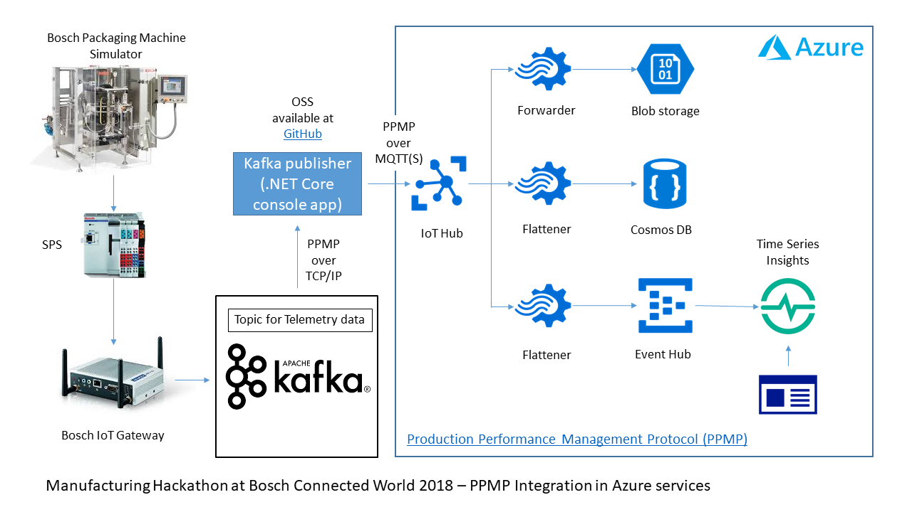

# Kafka to Azure IoT Hub Publisher

Sample [.NET Core](https://docs.microsoft.com/en-us/dotnet/core/) console application that acts as a [Kafka](http://kafka.apache.org/) consumer. Any messages found on specified Kafka topics will be immediately forwarded to the configured Azure IoT Hub instance.

Originally this sample was developed at the [Manufacturing Hack Challenge](http://bcw.bosch-si.com/berlin/manufacturing-4-0/) at [Bosch Connected World 2018 in Berlin](http://bcw.bosch-si.com/berlin/). It was part of the following technical architecture:


Telemetry data, sent by a Bosch Packaging simulator, was gathered by an Bosch IoT gateway and pushed to an Apache Kafka server that was running in the 'Fog' layer of the installation. The message payload data format used for the telemetry data was the [Production Performance Management Protocol](https://www.eclipse.org/unide/specification/), that is part of the [Eclipse Unide project](https://www.eclipse.org/unide/).

## Configuration
Configuration consists of two parts. First part is for the Kafka cluster, the source of the telemetry data, and second is for the Azure IoT Hub, the sink or the target of the telemetry data publishing. 

Except for the Azure IoT Hub connection string all configuration parameters can be set by using the following command line arguments:

  -b, --brokerlist             bootstrap.servers: A list of host/port pairs to 
                               use for establishing the initial connection to 
                               the Kafka cluster. The client will make use of 
                               all servers irrespective of which servers are 
                               specified here for bootstrapping—this list only 
                               impacts the initial hosts used to discover the 
                               full set of servers. This list should be in the 
                               form host1:port1,host2:port2,.... Since these 
                               servers are just used for the initial connection
                               to discover the full cluster membership (which 
                               may change dynamically), this list need not 
                               contain the full set of servers (you may want 
                               more than one, though, in case a server is down).

  -t, --topics                 Required. Kafka cluster topics to subscribe to

  -c, --consumergroup          Aka group.id: A unique string that 
                               identifies the consumer group this consumer 
                               belongs to. This property is required if the 
                               consumer uses either the group management 
                               functionality by using subscribe(topic) or the 
                               Kafka-based offset management strategy.

  -s, --security.protocol      Protocol used to communicate with brokers. Valid
                               values are: PLAINTEXT, SSL, SASL_PLAINTEXT, 
                               SASL_SSL.
                               r-version-compatibility

  -m, --samplingrate           (Default: 1000) Sampling rate in milliseconds 
                               used to poll messages from Kafka broker

  -f, --flatten                (Default: false) 

  -x, --configFile             Configuration file location for additional Kafka
                               consumer configuration parameters. Must be 
                               stored as key value pairs in a json file

  --iothubprotocol             (Default: Mqtt_Tcp_Only) the protocol to use for
                               communication with Azure IoT Hub

  --session.timeout.ms         (Default: 30000) The timeout used to detect 
                               consumer failures when using Kafka's group 
                               management facility. The consumer sends periodic
                               heartbeats to indicate its liveness to the 
                               broker. If no heartbeats are received by the 
                               broker before the expiration of this session 
                               timeout, then the broker will remove this 
                               consumer from the group and initiate a 
                               rebalance. Note that the value must be in the 
                               allowable range as configured in the broker 
                               configuration by group.min.session.timeout.ms 
                               and group.max.session.timeout.ms.


  --help                       Display this help screen.

  --version                    Display version information.

The Azure IoT Hub connection string can be set by using the environment variable KAFKAPUB_HUB_CS.

## Run as .NET Core console application

You can run Kafka IoT Hub publisher using systems with installed .NET Core runtime:
```powershell
dotnet KafkaPublisher.dll --topics=i31lpvwu-foo --api.version.request=true --configFile=/config/CloudKafkaConfig.json
```
with the configuration file 'CloudKafkaConfig.json':
```json
{
	"bootstrap.servers" : "[Your Kafka cluster endpoint]]",
	"security.protocol" : "SASL_SSL",
	"sasl.mechanisms" : "SCRAM-SHA-256",
	"sasl.username" : "[Your username]]",
	"sasl.password" : "[Your password]",
	"ssl.ca.location" : "C:\\Dev\\iotedge\\kafka\\cloudkarafka\\ssl\\ca_cert.pem"
}
```

## Run as Docker container

You can run Kafka IoT Hub publisher as docker container. A sample configuration for Windows looks like (see runOnDocker_Windows.ps1 Powershell script in scripts folder):
```powershell
docker run -d `
    --name kafka-iot-publisher `
    -v C:\Dev\iotedge\kafka:/config `
    --env KAFKAPUB_HUB_CS=$env:KAFKAPUB_HUB_CS `
    kafka-iothub-publisher:latest `
    dotnet KafkaPublisher.dll --topics=i31lpvwu-foo --api.version.request=true --configFile=/config/CloudKafkaConfig_Docker.json
```

## Run as Azure IoT Edge module

TBD